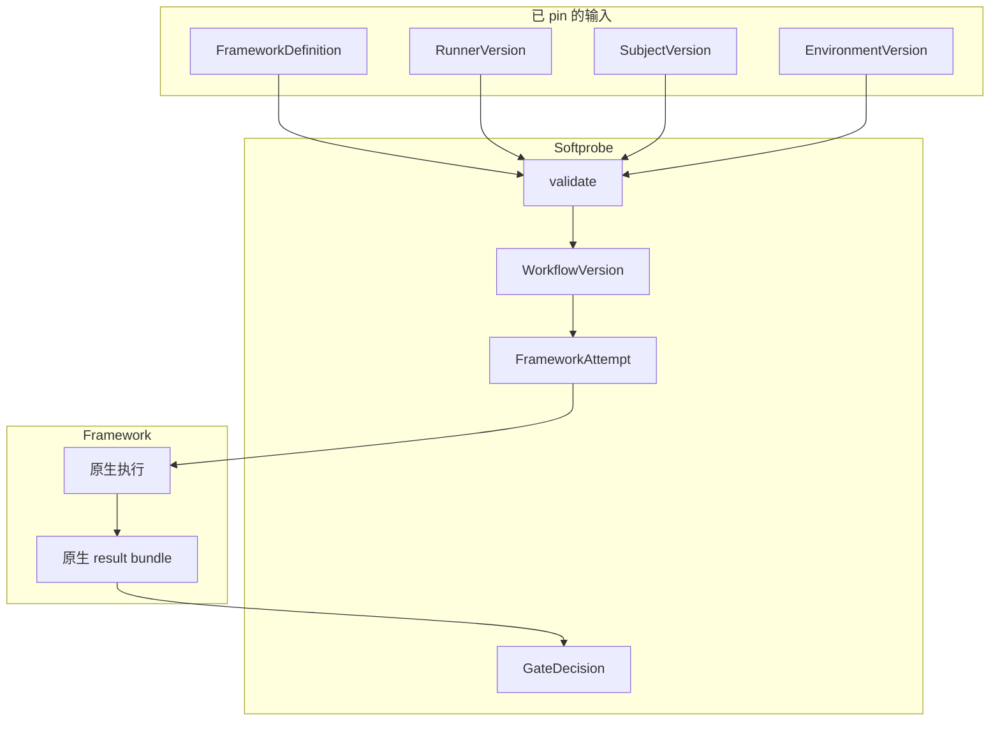

# Framework runners

框架互操作以 **runner 优先**。Softprobe 不承诺对 Promptfoo、DeepEval 或未来工具做完整 DSL 翻译。

（旧文档可能写作 “framework adapters”。请优先使用 **framework runner**。）

## Runner 模型



## Softprobe 负责什么 vs 不负责什么

| Softprobe 会做 | Softprobe 不会做 |
|----------------|------------------|
| Pin definition、runner、subject、environment | 把断言翻译成 Softprobe JSON |
| 强制能力与隔离 | 实现 Promptfoo/DeepEval scorer |
| 捕获原生 result + 证据 | 展开框架内部的 case 矩阵 |
| 外层生命周期 + GateDecision | 把 trials/reducers 当作 Softprobe 插件来拥有 |

## 示例：Promptfoo runner pin

```yaml
framework_definition: cas://sha256:42a...
runner:
  id: promptfoo-runner@2.1.0
  runtime_image: ghcr.io/softprobe/promptfoo-runner@sha256:9c3...
subject: support-router@sha256:...
environment:
  network: off
  filesystem: [workspace:ro, artifacts:rw]
  secrets: [OPENAI_API_KEY_REF]
  limits:
    timeout_s: 300
    max_result_mb: 50
gate_policy: support-router-v1
```

## 校验诊断

```json
{
  "ok": false,
  "error": {
    "code": "RUNNER_DEFINITION_NOT_CLOSED",
    "message": "Unpinned file reference: prompts/router.txt"
  }
}
```

```json
{
  "ok": false,
  "error": {
    "code": "RUNNER_RESULT_INVALID",
    "message": "result bundle exceeds declared max_result_mb"
  }
}
```

## 可选投影

框架原生 result 仍是权威制品：

```json
{
  "native_result_artifact": "cas://sha256:result-bundle",
  "projected_measurements": [
    { "name": "router.skill_match", "value": true }
  ],
  "projection_status": "lossy"
}
```

不支持的字段留在原生制品中，并在诊断中标出。

## 安全与信任

- Runner 不能直接追加 Softprobe 生命周期事件。
- Runner 不能发布权威门禁。
- 所有上传在 commit 前校验。
- 能力授权显式且遵循最小权限。

## 相关

- [原生模型与 framework runners](/zh/evaluation/concepts/native-model-and-adapters)
- [Promptfoo 集成](/zh/evaluation/guides/promptfoo-integration)
- [Trust boundaries](/zh/evaluation/architecture/trust-boundaries)
