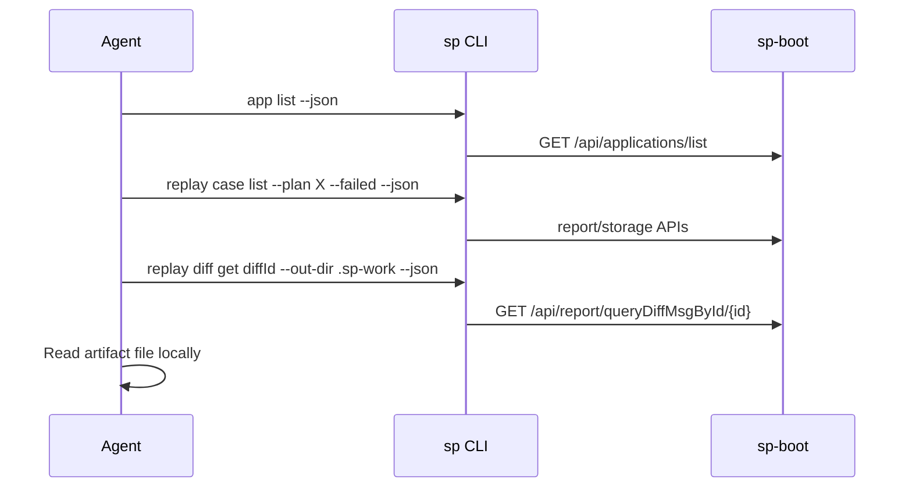

# For AI agents

This page is the primary entry point for authors of **OpenCode / spcode**, **Claude Code**, **Codex**, **Cursor**, and other agent hosts that invoke SoftProbe through shell tools.

## Design goals

1. **One process, one job** — each tool call runs a single `sp` command with explicit flags. Do not rely on shell aliases or interactive prompts.
2. **Always pass `--json`** for machine parsing unless you are showing output to a human in chat.
3. **Use artifacts for large payloads** — diff bodies, log downloads, and record queries write files under `--out-dir`; stdout returns paths and summaries only.
4. **Backend data only** — use API commands (`sp app`, `sp replay`, `sp record`, …) for cluster state.

## Recommended tool shape

Wrap `sp` as a shell tool with a fixed argv prefix:

```bash
sp --json --profile "${SP_PROFILE:-default}" <subcommand> ...
```

Environment variables agents should set in the host config:

| Variable | Purpose |
|----------|---------|
| `SP_API_URL` | Backend base URL (e.g. `http://127.0.0.1:8090`) |
| `SP_TOKEN` | JWT from `sp auth login` or CI secret |
| `SP_PROFILE` | Named profile in `${XDG_CONFIG_HOME}/softprobe/config.jsonc` or `sp.jsonc` |
| `SP_CONFIG` | Extra config file path loaded after `sp.jsonc` and before `--config` |

`sp` also reads `${XDG_CONFIG_HOME:-~/.config}/softprobe/config.jsonc` for
shared SoftProbe settings and `${XDG_CONFIG_HOME:-~/.config}/softprobe/sp.jsonc`
for CLI-specific overrides. Agents should prefer `SP_API_URL` and `SP_TOKEN`
when running in ephemeral CI containers.

## Lifecycle command order

Use these job-oriented commands before low-level building blocks:

1. `sp doctor --json`
2. `sp app create <name> --json` → save `data.appId`
3. `sp policy recording apply -f … --json`
4. 从 `install.softprobe.ai` 下载 `sp-agent.jar`，然后运行 `sp agent command --app <id> --agent-jar ./sp-agent.jar --json`
5. Start the app with `data.startCommand`; send traffic
6. `sp record case list --app <id> --since -1h --json`
7. `sp policy mock apply` / `sp policy compare apply`
8. `sp replay run --app <id> --env <service-base-url> --json`
9. `sp replay status <planId> --json` or `sp diagnose replay <planId> --json`

## Typical skill flows

### Diagnose a failed replay



Commands: see [Diagnose replay failure](/zh/testing/examples/agent-diagnose-replay).

### Change policy and re-run

1. `sp policy recording validate -f policy.yaml --json`
2. `sp policy recording apply -f policy.yaml --json`
3. `sp replay run --app … --env <service-base-url> --json`
4. `sp replay status <planId> --watch --json`

## Migrating from `sp_api` (spcode plugin)

The OpenCode `@spcode/plugin` tool `sp_api` uses named endpoints (`diff_detail`, `query_replay_case`, …). The `sp` CLI exposes the same operations as **stable subcommands**. 

| Old | New |
|-----|-----|
| `sp_api endpoint=list_applications` | `sp app list --json` |
| `sp_api endpoint=diff_detail diffId=…` | `sp replay diff get … --out-dir … --json` |
| `sp_api endpoint=find_traces_by_attr …` | `sp trace find … --json` |

Skills should be updated to call `sp` so behavior is consistent outside OpenCode.

## Error handling for agents

| Exit code | Meaning | Agent action |
|-----------|---------|--------------|
| `0` | Success | Parse stdout JSON |
| `1` | API or business error | Read stderr JSON `error` field; may retry or ask user |
| `2` | Usage / missing config / auth | Fix argv or run `sp auth login` / set `SP_TOKEN` |
| `3` | Auth required | Refresh token |

See [Output contract](./output-contract) and [Exit codes](/zh/testing/reference/exit-codes).

## What not to call

- Agent write APIs (`POST /api/storage/record/save`, batch saves) — instrumentation only
- OTLP ingestion (`/v1/traces`) — use collectors
- Mutating `sp ops` without `--confirm` — blocked by design

## Related pages

- [Output contract](./output-contract)
- [Versioning](./versioning)
- [Commands](/zh/testing/commands/)
