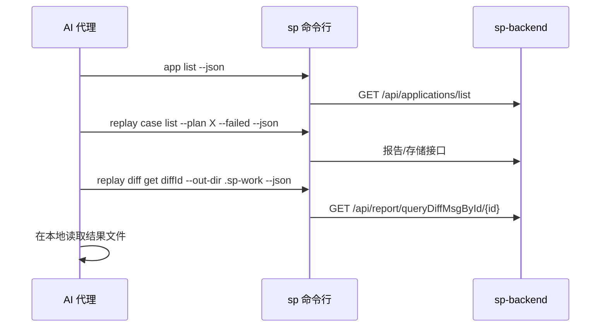

# 选择接入方式

这一部分写给要用脚本、CI 任务、插件或 AI 代理技能对接 SoftProbe 的人，也写给 AI 代理本身（OpenCode / spcode、Claude Code、Codex、Cursor 等通过命令行工具调用 SoftProbe 的宿主）。

## 选哪种方式 {#pick-an-interface}

| 你要做的事 | 用什么 |
|---|---|
| 发版后触发回放，并按结果决定流水线是否继续 | [发版后自动回放](/zh/testing/webhook-and-ci) 中的 HTTP 接口和 [回放触发 Open API](/zh/testing/reference/replay-openapi) |
| 查录制、回放结果、差异和日志，或诊断失败的回放 | `sp` 命令行（本部分和 [命令参考](/zh/testing/commands/)） |
| 把录制、Mock、对比策略作为文件放进 Git 管理 | `sp policy` 和 [策略 YAML 参考](/zh/testing/policy-yaml-guide) |
| 人工查看报告和差异 | 网页控制台，见 [回放报告](/zh/testing/replay-report) |

## 让 AI 代理读这些文档 {#feed-these-docs-to-your-agent}

整套文档按 [llmstxt.org](https://llmstxt.org/) 格式发布，AI 代理不用抓 HTML 就能读：

| 地址 | 内容 |
|-----|------|
| [`/llms.txt`](/llms.txt) | 全部页面的索引和简介，体积小，适合作为入口 |
| [`/llms-full.txt`](/llms-full.txt) | 全部文档合成的一个纯文本文件 |
| `‹任意页面›.md` | 单个页面的 Markdown 原文（在页面地址后加 `.md`） |

先让 AI 代理读 `/llms.txt`，需要时它会顺着链接去读全文或单页的 `.md`。

## 各部分怎么配合 {#how-softprobe-works}

| 组成部分 | 作用 |
|------|------|
| **你的 Java 服务** | 启动时带上 `-javaagent:/path/to/sp-agent.jar` |
| **SoftProbe Java Agent** | 运行时织入字节码，不改代码就能录下 HTTP、数据库、缓存、RPC 等依赖调用；回放时用录制结果代替这些调用 |
| **SoftProbe 后端（sp-backend）** | 保存录制数据、策略、回放计划、日志、对比结果和 Agent 心跳；读写数据的 `sp` 命令都通过 HTTP 访问它（默认端口 `:8090`） |
| **`sp` 命令行** | 注册应用、发布策略、查看 Agent 状态、查询录制数据、发起回放、诊断失败。JSON 输出稳定，退出码可预期，大块内容写到文件，见 [输出约定](/zh/testing/agents/output-contract) |

回放需要先有录制用例，而用例只能来自挂着 Agent 真实运行过的应用，所以新系统上第一步永远不是回放。

Agent 通过 JVM 参数挂载。请显式固定应用 ID：SoftProbe 靠它区分录制数据、拉取配置、匹配回放数据（它和 `OTEL_SERVICE_NAME` 无关）。可以用 `sp app create` 返回的 ID，也可以用 `order-service` 这类固定、非空的名字；后端没见过的 ID 通常会在 Agent 第一次拉取配置时自动注册（例外见 [概念与编号](/zh/testing/agents/concepts#application-appid)）：

```bash
java \
  -javaagent:/opt/softprobe/sp-agent.jar \
  -Dsp.app.id=a1b2c3d4e5f67890 \
  -Dsp.api.url=http://127.0.0.1:8090 \
  -jar order-service.jar
```

完整接入步骤见 [接入 Java Agent](/zh/testing/java-agent)。

## AI 代理怎么调用 `sp` {#calling-sp-from-an-agent}

1. **一个进程只做一件事**：每次工具调用只执行一条 `sp` 命令，参数写全。不用 shell 别名，不走交互式提问。
2. **始终加 `--json`**，除非输出是给人看的。
3. **大块内容从文件读**：`replay diff get`、`replay mock-tree`、`diagnose replay` 会把结果写到 `--out-dir` 下的文件，`record query` 超过 4 KiB 时也会；这时标准输出只给路径和摘要。`sp logs` 总是把日志行直接打到标准输出，请重定向到文件。见 [输出约定 — 大块输出](/zh/testing/agents/output-contract#artifacts-large-output)。

把 `sp` 包装成一个命令行工具，固定参数前缀：

```bash
sp --json --profile "${SP_PROFILE:-default}" <子命令> ...
```

在宿主配置里设置这些环境变量：

| 变量 | 用途 |
|----------|---------|
| `SP_API_URL` | 后端地址（如 `http://127.0.0.1:8090`） |
| `SP_TOKEN` | `sp auth login` 得到的 token，或 CI 中的密钥 |
| `SP_PROFILE` | `${XDG_CONFIG_HOME}/softprobe/config.jsonc` 或 `sp.jsonc` 中的配置档案名 |
| `SP_CONFIG` | 额外的配置文件，在 `sp.jsonc` 之后、`--config` 之前加载 |

`sp` 还会读取 `${XDG_CONFIG_HOME:-~/.config}/softprobe/config.jsonc` 中的共用设置，以及 `${XDG_CONFIG_HOME:-~/.config}/softprobe/sp.jsonc` 中仅供命令行使用的设置。在用完即弃的 CI 容器里，优先用 `SP_API_URL` 和 `SP_TOKEN`。

退出码和错误怎么判断，见 [输出约定 — 退出码](/zh/testing/agents/output-contract#exit-codes)。

## 新应用的命令顺序 {#lifecycle-command-order}

1. `sp doctor --json`
2. `sp app create <name> --json` → 记下 `data.appId`
3. `sp policy recording apply -f … --json`
4. 下载 `sp-agent.jar`（见 [接入 Java Agent — 下载](/zh/testing/java-agent#download)），然后 `sp agent command --app <id> --agent-jar ./sp-agent.jar --json`
5. 用 `data.startCommand` 启动应用，并发送流量
6. `sp record case list --app <id> --since -1h --json`
7. `sp policy mock apply` / `sp policy compare apply`
8. `sp replay run --app <id> --env <被测服务根地址> --json`
9. `sp replay status <planId> --json` 或 `sp diagnose replay <planId> --json`

## 常见流程 {#typical-flows}

### 诊断失败的回放 {#diagnose-a-failed-replay}



分步说明见 [排查回放失败](/zh/testing/examples/agent-diagnose-replay)。

### 改策略后重新回放 {#change-a-policy-and-re-run}

1. `sp policy recording validate -f policy.yaml --json`：看 `data.valid`，策略不合法时这个命令也以 `0` 退出
2. `sp policy recording apply -f policy.yaml --json`
3. `sp replay run --app … --env <被测服务根地址> --json`
4. `sp replay status <planId> --watch --json`

## 不要调用的接口 {#what-not-to-call}

- Agent 写数据的接口（`POST /api/storage/record/save`、批量保存）：只给探针用
- OTLP 数据接收（`/v1/traces`）：请用采集器

会删除或修改共享数据的命令，比如 `sp policy <类型> delete`、`sp replay noise exclude` 和实时回放队列控制，不带 `--confirm` 会拒绝执行。AI 代理加这个参数之前，请先让人确认。

## 从 spcode 插件的 `sp_api` 迁移 {#migrating-from-the-spcode-plugins-sp_api-tool}

spcode / OpenCode 插件里的 `sp_api` 工具按接口名调用（`diff_detail`、`query_replay_case` 等）。`sp` 命令行把同样的操作做成了固定的子命令，所以技能在 spcode 之外也能照常工作：

| 旧写法 | 新写法 |
|-----|-----|
| `sp_api endpoint=list_applications` | `sp app list --json` |
| `sp_api endpoint=diff_detail diffId=…` | `sp replay diff get … --out-dir … --json` |
| `sp_api endpoint=find_traces_by_attr …` | `sp trace find … --json` |

## 示例 {#examples}

- [排查回放失败](/zh/testing/examples/agent-diagnose-replay)：从失败的回放计划，或从订单号这类业务编号出发，找到差异和相关日志
- [用 Git 管理策略](/zh/testing/examples/gitops-policies)：导出、评审、在 CI 中校验、发布
- [发版后自动回放](/zh/testing/webhook-and-ci)：一份完整的流水线脚本

## 参考 {#reference}

- [命令参考](/zh/testing/commands/)
- [输出约定](/zh/testing/agents/output-contract)：信封、退出码、JSON 结构、版本
- [概念与编号](/zh/testing/agents/concepts)
- [回放触发 Open API](/zh/testing/reference/replay-openapi)
- [命令与后端接口对照](/zh/testing/reference/api-mapping)
- [日志查询字段](/zh/testing/commands/log-query-fields)
- [回放发送日志标记](/zh/testing/reference/replay-send-log-markers)
