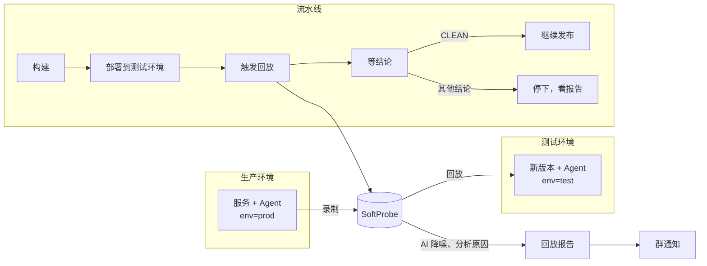

# 最佳实践：发版后自动回归（CI/CD 全流程）

本页把录制、回放、AI 分析、流水线门禁和群通知串起来，讲一个服务从接入到「每次发版自动回归」的完整做法，最后附一次真实运行的记录。每一步的细节链接到对应页面。

做到之后的效果：新版本部署到测试环境后，流水线自动拿生产环境录下的请求回放一遍。有问题就停下，并在群里说明哪个接口、哪个字段变了；接入 AI 后，还会分析差异是不是代码改动引起的、改在哪里。没问题就继续发布。

## 全流程 {#overview}



## 一次性准备 {#setup}

### 1. 生产环境录制 {#record-prod}

在生产（或预发）实例的启动参数里挂上 Agent，并打上环境标签：

```bash
-javaagent:/opt/softprobe/sp-agent.jar -Dsp.app.id=order-service \
-Dsp.api.url=http://sp-backend.internal:8090 -Dsp.tags.env=prod
```

默认每台机器、每个接口每分钟最多录 1 条，一般够用。想多录一些，在「配置 → 录制配置」的采样规则里加一条：生效环境填 `env=prod`，调高采样率。

同样的规则也可以写成 YAML，放进 Git 管理，应用方法见 [用 Git 管理策略](/zh/testing/examples/gitops-policies)。其中 `ratePerHundredSeconds` 就是页面上的「采样率（次/分钟）」，字段名是沿用下来的：

```yaml
apiVersion: softprobe.ai/v1
kind: RecordingPolicy
metadata:
  name: order-service-prod-sampling
  priority: 20
selector:
  appIds: [order-service]
  envTags:
    env: [prod]
spec:
  sampling:
    ratePerHundredSeconds: 10
```

录多少够用：主链路接口每个都有几十条、覆盖常见的参数组合即可，不需要全量。用到本地缓存的，在「录制配置」里配好「覆盖包」；每次返回值都不同的业务方法（例如加解密、自己实现的流水号生成），登记为 [动态类](/zh/testing/policies#dynamic-classes)，回放才能复现。系统时间、随机数已经内置处理，不用登记。见 [接入 Java Agent](/zh/testing/java-agent) 和 [录制配置与回放配置](/zh/testing/policies)。

### 2. 测试环境 {#test-env}

测试环境的实例同样挂上 Agent，用**同一个应用 ID**，标签打 `env=test`：

```bash
-javaagent:/opt/softprobe/sp-agent.jar -Dsp.app.id=order-service \
-Dsp.api.url=http://sp-backend.internal:8090 -Dsp.tags.env=test
```

测试环境不录制，避免把回放请求又录一遍。在采样规则里加一条：生效环境填 `env=test`，采样率设为 0。写成 YAML：

```yaml
apiVersion: softprobe.ai/v1
kind: RecordingPolicy
metadata:
  name: order-service-test-no-recording
  priority: 20
selector:
  appIds: [order-service]
  envTags:
    env: [test]
spec:
  sampling:
    ratePerHundredSeconds: 0
```

网络上，生产和测试环境的实例都要能访问 SoftProbe 后端（Agent 要上报数据、拉取配置，回放时要取录制结果），后端要能访问测试环境的服务端口，CI 机器要能访问后端。见 [部署前准备 — 网络策略](/zh/testing/installation/preparation#network)。

### 3. 登记主链路接口 {#main-operations}

没有登记主链路接口时，回放正常结束、也没有待处理或待核对的问题，但回放的接口少于 10 个或请求少于 30 条，结论会是 `LOW_COVERAGE`。登记之后，改为检查清单里的接口是否都回放到了。服务只有少数几个接口，或者只回放少数关键接口的，先登记：

```bash
curl -X POST http://sp-backend.internal:8090/api/config/schedule/modify/UPDATE \
  -H 'Content-Type: application/json' \
  -d '{"appId": "order-service", "mainOperations": ["/order/price", "/catalog/item", "/user/profile"]}'
```

见 [发版后自动回放 — 主链路接口](/zh/testing/webhook-and-ci#main-operations)。

### 4. 接入 AI 和代码仓库（建议） {#ai}

接入模型服务、给应用绑定代码仓库后，按默认的流程设置，流水线触发的回放会先自动降噪，把时间戳、随机 ID 这类每次都变的字段识别为噪音并忽略；仍有没通过的用例时，再自动分析原因。分析结果写进报告和群通知，查明是代码改动引起的，会指出改在哪个文件的哪一行；也可能有查不出原因的用例。见 [配置 AI 诊断与代码仓库](/zh/testing/installation/ai-diagnosis)。

- AI 读取的是绑定的分支上的代码，不核对它和测试环境里实际运行的版本是否一致。绑定的分支应当就是部署到测试环境的分支，例如发布分支。报告里会注明分析时读取的分支和提交。
- 自动降噪、自动分析能不能执行，取决于 [流程设置](/zh/testing/replay-report#flow-settings) 里的开关和每日次数上限。每日自动分析默认最多 10 次，发版频繁时在这里调高。

不接 AI 也能录制、回放、按对比规则判定，只是没有自动降噪和原因分析。

### 5. 先把噪音清到基线 {#baseline}

把**和生产相同的版本**部署到测试环境，用下面 [接进流水线](#pipeline) 的脚本、按流水线里的参数触发一次回放，打开输出的报告链接，处理报告里的差异：

- 时间戳、流水号、随机 ID 这类每次都变的字段：配成 [对比规则](/zh/testing/compare-rules-web-ui)，或者在报告的「已忽略的噪音」里把 AI 识别出的噪音点「永久忽略」。
- 测试环境和生产环境配置不同导致的差异：先调整测试环境；确实无法一致的调用，再考虑登记为动态类。

处理完再触发一次，直到脚本输出的结论是 `CLEAN`。基线清干净了，之后的发版才不会反复被同样的噪音拦下。

### 6. 通知渠道 {#notify}

在「设置 → 通知」里加飞书或钉钉群机器人，生效应用选这个应用，加好后点「测试发送」，确认群里能收到。只想在有问题时收到，打开「只在失败时发」。

结论为 `NEEDS_ACTION` 或 `REVIEW_ONLY`、且这次会自动分析原因时，通知等分析出结果再发，最多等 20 分钟；超时照常发出，并写明分析进度。要把结果接进自己的系统，渠道类型选 Webhook，AI 分析的正文会另外单独推送一次。见 [回放结果通知](/zh/testing/notifications)。

### 7. 规则放进 Git（可选） {#gitops}

采样、Mock、对比规则都可以写成 YAML，和代码一起评审、一起发布。见 [用 Git 管理策略](/zh/testing/examples/gitops-policies)。

## 接进流水线 {#pipeline}

先确认 [准备工作](/zh/testing/webhook-and-ci#before-you-start) 里的条件：这组接口仅私有化部署可用；All-in-One 部署要先设置 `SP_REPLAY_OPENAPI=true` 并重启服务；执行脚本的机器要装好 bash、curl 和 jq。

然后在「部署到测试环境、健康检查通过」之后，「发布到下一个环境」之前，加一步执行 [完整脚本](/zh/testing/webhook-and-ci#script)，传入这些环境变量：

| 变量 | 本例的值 | 说明 |
|------|---------|------|
| `SP_BACKEND` | `http://sp-backend.internal:8090` | SoftProbe 后端地址 |
| `SP_APP_ID` | `order-service` | 应用 ID |
| `SP_TARGET` | `http://order-service.test:8080` | 测试环境里新版本的地址 |
| `SP_CASE_TAGS` | `{"env":"prod"}` | 只回放生产环境录下的请求 |
| `SP_CASE_SOURCE_HOURS` | `24` | 回放最近多少小时的录制，正整数 |
| `SP_REVISION`、`SP_BRANCH` | 提交、分支 | 显示在报告和群通知里 |
| `SP_PIPELINE_RUN_ID`、`SP_PIPELINE_RUN_URL` | 流水线编号、链接 | 群通知里能直接点回流水线 |
| `SP_TIMEOUT_SECONDS` | `1800`（默认） | 最长等多少秒，超时按退出码 `2` 处理 |

脚本的退出码：

| 退出码 | 结论 | 流水线 |
|---|---|---|
| `0` | `CLEAN` | 继续发布 |
| `1` | `NEEDS_ACTION`、`REVIEW_ONLY` | 停下，有问题要处理或核对 |
| `2` | `LOW_COVERAGE`、`NO_CASES`、`INTERRUPTED`、`ENVIRONMENT_FAILURE`，或调用出错、等待超时 | 停下，这次没有完成验证 |

Jenkins、GitLab CI、GitHub Actions 的写法见 [在流水线中使用](/zh/testing/webhook-and-ci#在流水线中使用)。接好后，用一个没有改动的版本和一个故意改坏的版本各跑一次，确认退出码真的能拦住发布。团队允许在核对后放行的，在流水线里预先配好人工确认的步骤。

::: tip 流水线要等多久
脚本等回放结束、AI 降噪完成后就拿到结论，不等 AI 分析原因。分析在后台继续，完成后写入报告，并发出群通知。[下面的真实运行](#example) 中：第一次有差异，从触发到脚本退出约 2 分钟，通知在脚本退出约 10 分钟后收到；第二次全部通过，这一步反而用了约 8 分钟，其中回放 1 分 36 秒，其余是在等 AI 降噪收尾，并不是在分析原因。`SP_TIMEOUT_SECONDS` 要给回放和 AI 降噪都留出余量。
:::

## 结论出来之后 {#triage}

| 结论 | 通常意味着 | 怎么处理 |
|------|-----------|---------|
| `CLEAN` | 回放了足够的请求，没发现问题 | 继续发布 |
| `NEEDS_ACTION` | 有接口报错、字段值变了、字段缺失或下游调用少了 | 打开报告，先看全部待处理的问题；AI 分析完成后，再按「代码改动引起的差异」「原因未查明」「无效」分别判断。是预期内的改动，在报告里标记通过，再按团队流程人工放行；不是，修复后重新发版 |
| `REVIEW_ONLY` | 需要人工核对的差异，例如新增字段、下游调用增加、下游请求参数变化，或个别接口返回 401、超时 | 按具体原因核对后决定是否放行 |
| `LOW_COVERAGE` | 回放的接口或请求太少，或者主链路接口没回放到 | 补录制，或登记、补齐主链路接口 |
| `NO_CASES` | 没有可回放的请求 | 查生产环境是否在录、`SP_CASE_TAGS` 和 `SP_CASE_SOURCE_HOURS` 是否对得上 |
| `ENVIRONMENT_FAILURE`、`INTERRUPTED` | 大量接口出现同一种失败，或回放没有跑完 | 看报告里的失败原因，查被测服务是否正常、地址和网络是否可达。大量接口都返回 500 时，也可能是应用本身出错。处理后重跑流水线 |

报告的读法见 [回放报告](/zh/testing/replay-report)，逐条看差异见 [审查差异](/zh/testing/review-diffs-in-the-web-ui)。

::: info 有意的改动上线之后
改动上线后，生产环境会逐渐录到新版本的请求。旧版本的请求还在 `SP_CASE_SOURCE_HOURS` 的时间范围内时，之后的发版还会报出同一处差异，流水线还会停下。「标记通过」只对当次回放有效，每次都要再核对；报告和群通知里会注明这处差异已连续出现几次，便于认出重复出现的差异。`SP_CASE_SOURCE_HOURS` 最小为 1 小时。生产环境的旧版本实例都下线、新版本的录制已经覆盖主链路接口后，可以把时间范围缩短。
:::

## 一次真实运行 {#example}

下面是在一套演示环境里按本页做法跑的一次完整记录：

- 被测服务是一个计价服务，应用 ID 为 `sp-diag-e2e-app`，有 3 个接口，都已登记为主链路接口；对比规则里已排除每次都会变的 `quoteId`、`quotedAt`。
- 生产实例和测试实例在同一台机器上，用两个端口模拟，生产流量由脚本模拟。
- 已接入 AI，并绑定了代码仓库；通知渠道用的是 Webhook。
- 流水线这一步直接执行 [完整脚本](/zh/testing/webhook-and-ci#script)，`SP_CASE_SOURCE_HOURS` 设为 `1`。

### 发版前：生产环境在录制 {#example-record}

生产实例带着 `env=prod` 标签运行，按 [第 1 步](#record-prod) 加了采样规则。演示流量少，采样率设成了 30 次/分钟。发版时回放的是此前一小时内录下的请求，共 237 个。

### 第一次发版：取整方式变了 {#example-first}

开发提交了 `0026097`「调整会员价计算」，把会员价由四舍五入改成向下取整：

```diff
-    return listPrice.multiply(MEMBER_DISCOUNT).setScale(0, RoundingMode.HALF_UP);
+    return listPrice.multiply(MEMBER_DISCOUNT).setScale(0, RoundingMode.FLOOR);
```

新版本部署到测试环境后，流水线执行回放这一步，输出如下（报告链接中的控制台地址已替换）：

```text
已触发回放，planId=6abc8d38e5eb34767296cc10
回放结论：NEEDS_ACTION
报告：https://<控制台地址>/sp/workbench/sp-diag-e2e-app/runs/6abc8d38e5eb34767296cc10
```

退出码为 `1`，流水线停下。从触发到脚本退出共 2 分 06 秒：回放 1 分 39 秒，之后等 AI 降噪约 20 秒，其余是脚本的轮询间隔。

打开报告：237 条用例中 158 条通过、79 条未通过。`/order/price` 回放了 81 条，其中 79 条的 `payable` 比录制时少 1。AI 把这 79 条都归为代码改动引起，定位到 `PricingService.java:12` 和提交 `0026097`，并说明了原因：以标价 1990 为例，打 85 折是 1691.5，四舍五入得 1692，向下取整得 1691。


差异标题旁的「已连续 10 次」，是因为演示环境此前用同一个版本回放过多次。

### 群通知 {#example-notify}

脚本退出约 10 分钟后，AI 分析完成，通知渠道收到了这次回放的结论和 AI 分析结果。AI 分析的原文是：

> **AI 分析原因**：79 条用例未通过，其中 79 条查明原因。
>
> **代码改动引起的差异**（需开发确认是否预期）
>
> - 会员价改为向下取整，应付少 1 元 · 79 条用例 · PricingService.payable · src/main/java/diag/e2e/PricingService.java:12。处理方法：确认这次取整方式变更是否符合预期：若符合预期，将这些用例标记为通过；若不符合，修正代码后重新回放。

如果渠道是飞书或钉钉群机器人，群里收到的是一张卡片，标题为「sp-diag-e2e-app 发版回放：1 处差异由代码改动引起」。卡片包含哪些内容，见 [通知内容](/zh/testing/notifications#card)。

### 修复后重新发版 {#example-fix}

这次的改动不符合预期，开发把取整方式改回四舍五入，重新发版。流水线输出：

```text
已触发回放，planId=6abc8e97e5eb34767296cfcf
回放结论：CLEAN
报告：https://<控制台地址>/sp/workbench/sp-diag-e2e-app/runs/6abc8e97e5eb34767296cfcf
```

退出码为 `0`，流水线继续发布。237 条用例全部通过，回放用时 1 分 36 秒；这一步共用了约 8 分钟，多出来的时间在等 AI 降噪收尾（见 [流水线要等多久](#pipeline)）。

两次运行都能在「回放 → 执行记录」中查到，计划名称中的 128、129 是流水线编号：


如果改动符合预期，就在报告里点「标记通过（79 条）」，再在流水线里人工放行。

## 日常维护 {#maintenance}

- **固化核心场景**：核心交易流程、出过问题的请求固化下来，不受录制保留期影响。见 [固化用例](/zh/testing/pinned-cases)。
- **定时回放固化用例**：在「回放 → 定时任务」里定期用固化用例回放测试环境，确认核心场景在当前版本上仍然正常。回放时下游依赖默认用录制时的结果应答，所以发现不了下游接口本身的变化；定时回放也不推送群通知、不自动分析原因，要到执行记录里看结果。见 [定时回放](/zh/testing/replay-and-diff#scheduled)。
- **盯住噪音**：报告里「原因未查明」或被忽略的差异明显变多时，先看具体是什么变了、AI 读的是不是对应版本的代码；确认是时间戳、随机 ID 这类不影响业务的字段后，再补对比规则。
- **Agent 升级**：生产和测试环境用同一个 Agent 版本，先在测试环境验证再升生产。
