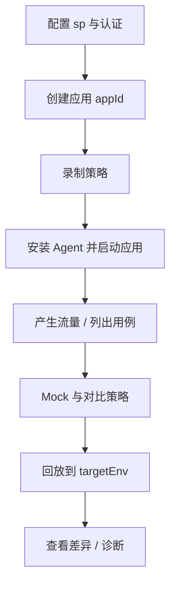

# Softprobe 测试快速开始

本文说明 Java 录制回放的**产品生命周期**。具体操作命令见 [CLI 快速入门](/zh/cli/guide/quickstart)；请先理解每一步在做什么，以及**为何回放不能作为第一步**。

## 前置条件

- 能以 `-javaagent` 启动的 Java 服务
- **sp-boot** 已运行（本地 Docker/E2E：端口 **8090**；云端：租户 API 地址）
- 已安装 `sp` CLI，或能访问同一后端的仪表盘
- Agent 主机到 sp-boot 网络可达

## 生命周期



| 步骤 | 动作 | 说明 |
|------|------|------|
| 1 | 环境检查 | `sp setup doctor`，配置 `SP_API_URL` 与令牌 — [CLI 快速入门 §1](/zh/cli/guide/quickstart) |
| 2 | 注册应用 | `sp app create <appName>` → 保存 `appId` — [概念](/zh/cli/guide/concepts#application-appid) |
| 3 | 录制策略 | 产生流量**之前** `sp policy recording apply` — [录制策略](/zh/testing/policies#recording-policy) |
| 4 | Agent | `sp agent download` + 以 `-Dsp.app.id` 启动 JVM — [Java Agent](/zh/testing/java-agent) |
| 5 | 录制 | 产生流量并确认用例 — [如何录制](/zh/testing/recording) |
| 6 | 提取规则（可选） | 若按业务 id（如 `orderId`）检索，请在大量流量前配置提取规则 |
| 7 | Mock 与对比策略 | 回放**之前**配置 — [Mock 与对比策略](/zh/testing/policies#mock-policy) |
| 8 | 回放 | `sp replay run --env <测试环境基础 URL>` — [回放与对比](/zh/testing/replay-and-diff) |
| 9 | 排查 | `sp replay diff`、`sp diagnose replay`、`sp trace find` |

::: tip
全新应用上**回放永远不是第一步**。在第 5 步产生用例之前，`sp replay run` 没有可执行的有效数据。
:::

## 录制环境与回放环境

| 环境 | Agent 录制 | 角色 |
|------|------------|------|
| 生产 / 预发 | 开启（按策略） | 采集真实流量 |
| 测试 / CI | 回放机：关闭或极低录制 | 接收回放 HTTP；Mock 依赖 |

需要按来源环境筛选用例时，使用 `-Dsp.tags.env=<标签>`。

## 最小命令速查

```bash
export SP_API_URL=http://127.0.0.1:8090
sp app create order-service --json
sp policy recording apply -f recording.yaml --json
sp agent download --json
# 按 sp agent command 输出启动 JVM
sp record case list --app <appId> --json
sp policy mock apply -f mock.yaml --json
sp policy compare apply -f compare.yaml --json
sp replay run --app <appId> --env http://127.0.0.1:8080 --json
```

将 `8080` 换成**你的应用**监听端口 — 不是 sp-boot 的 8090。

## 下一步阅读

| 目标 | 文档 |
|------|------|
| 如何产生用例 | [如何录制](/zh/testing/recording) |
| 理解采集与 Mock 机制 | [工作原理](/zh/testing/how-it-works) |
| JVM 参数与生产安全 | [Java Agent](/zh/testing/java-agent) |
| 框架覆盖范围 | [支持的框架](/zh/testing/supported-frameworks) |
| CI 或 Agent 自动化 | [CLI 概览](/zh/cli/guide/overview) |
| Istio / 前端可观测性 | [平台快速入门](/zh/platform/getting-started/quick-start) |

## 相关文档

- [Softprobe 测试概览](/zh/testing/)
- [CLI 快速入门](/zh/cli/guide/quickstart)
