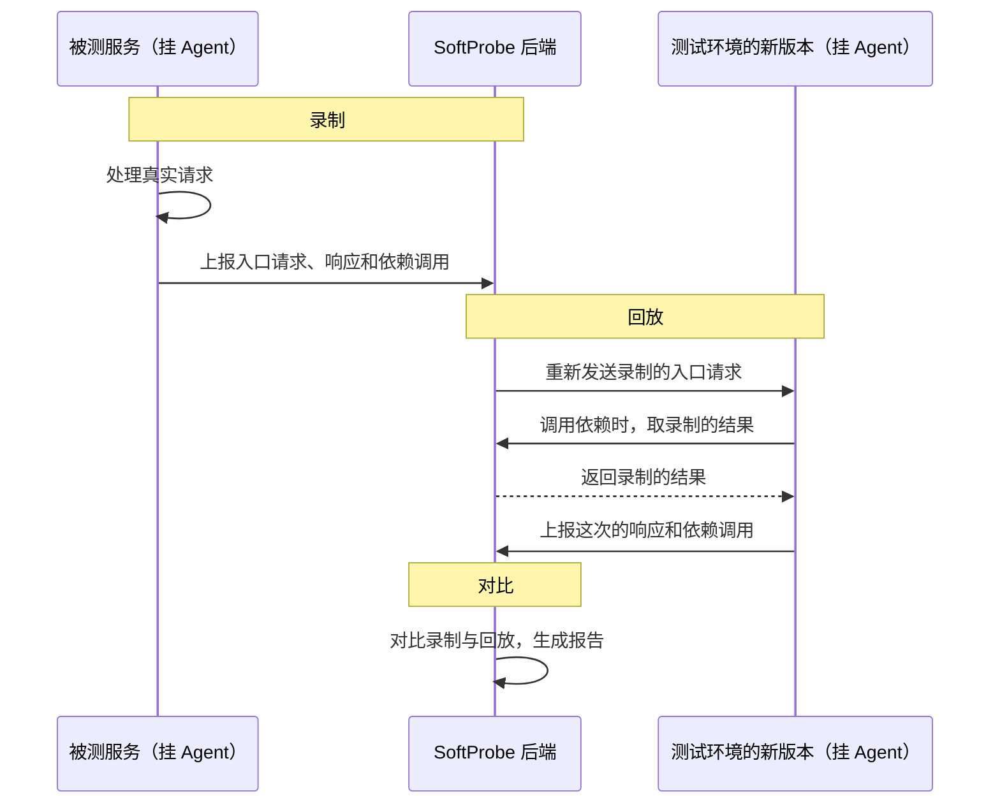

# 录制回放如何工作

SoftProbe 录的是一次完整的**请求处理**：一条入口请求，以及处理它时代码调用的每一个依赖。回放时，同一段业务代码再执行一遍；它调用依赖时，按配置用录制下来的结果应答。

## 全过程 {#end-to-end}



## 录制 {#recording-phase}

Agent 在服务里记录两类调用：

| 类型 | 例子 | 记录什么 |
|------|------|---------|
| **入口** | HTTP 接口（Servlet）、Dubbo 服务、消息消费 | 收到的请求和返回的响应 |
| **依赖** | 数据库、Redis、HTTP 客户端、Dubbo 调用、本地缓存、系统时间 | 每次调用的参数和结果 |

一条入口请求连同它触发的全部依赖调用，就是一个**用例**。录制按采样进行，默认每个实例、每个接口每分钟约 1 条。数据由 Agent 的后台线程上报，业务请求不等待网络。

用例只能靠录制产生，不能手工编写。怎么查看录制，见 [查看录制](/zh/testing/recording)；怎么调整录制范围，见 [录制配置](/zh/testing/policies#recording)。

## 回放 {#replay-phase}

一次回放（回放计划）选出一批用例，把它们的入口请求发给**目标环境**：测试环境里正在运行的服务地址，例如 `http://order-service.test:8080`。目标服务也要挂 Agent，使用同一个应用 ID。

1. 后端把录制的入口请求发给目标服务。
2. 目标服务真实执行业务代码：Controller、业务逻辑都会跑。
3. 代码调用依赖时，Agent 按「回放配置」决定：用录制时的结果应答（Mock），还是真的去调用。默认全部 Mock。
4. 这次的响应和依赖调用被记录下来。

Mock 只对 Agent 支持的依赖类型生效。回放配置里设为「走真实请求」的依赖、Agent 不支持的依赖，以及新建回放计划时选择「强制所有依赖走真实调用」时，回放都会真的访问外部系统。所以回放目标应该是测试环境。

## 对比 {#comparison}

回放结束后，把每个用例的录制结果和回放结果逐项对比：

- **入口响应**：返回给调用方的内容是否一致。
- **依赖调用**：调用的参数是否一致，有没有少调、多调。

常见的差异：

- **值不一致**：同一个字段，录制时和回放时的值不同。
- **少了调用**：录制时调用过的依赖，回放时没有调用。
- **多了调用**：回放时调用了录制里没有的依赖。

时间戳、随机 ID 这类每次都变的字段，用[对比规则](/zh/testing/compare-rules-web-ui)忽略。对比结果汇总成[回放报告](/zh/testing/replay-report)；接入 AI 诊断后，报告还会说明差异是不是代码改动引起的。

## 一个例子 {#example}

下面这个方法解析 IP 地址：

```java
public Integer parseIp(String ip) {
    int result = 0;
    if (checkFormat(ip)) {
        String[] ipArray = ip.split("\\.");
        for (int i = 0; i < ipArray.length; i++) {
            result = result << 8;
            result += Integer.parseInt(ipArray[i]);
        }
    }
    return result;
}
```

如果 `checkFormat` 依赖外部配置或运行环境，把它登记为[动态类](/zh/testing/policies#dynamic-classes)：录制时 Agent 记下它的参数和返回值；回放时直接返回录制的值，`parseIp` 就会按录制时的结果执行，即使测试环境的配置不同。本地缓存、加解密、系统时间也是这样处理的，不需要改业务代码。

## 相关文档 {#related}

- [接入 Java Agent](/zh/testing/java-agent)
- [录制配置与回放配置](/zh/testing/policies)
- [发起回放与定时回放](/zh/testing/replay-and-diff)
- [概念与编号](/zh/testing/agents/concepts)
