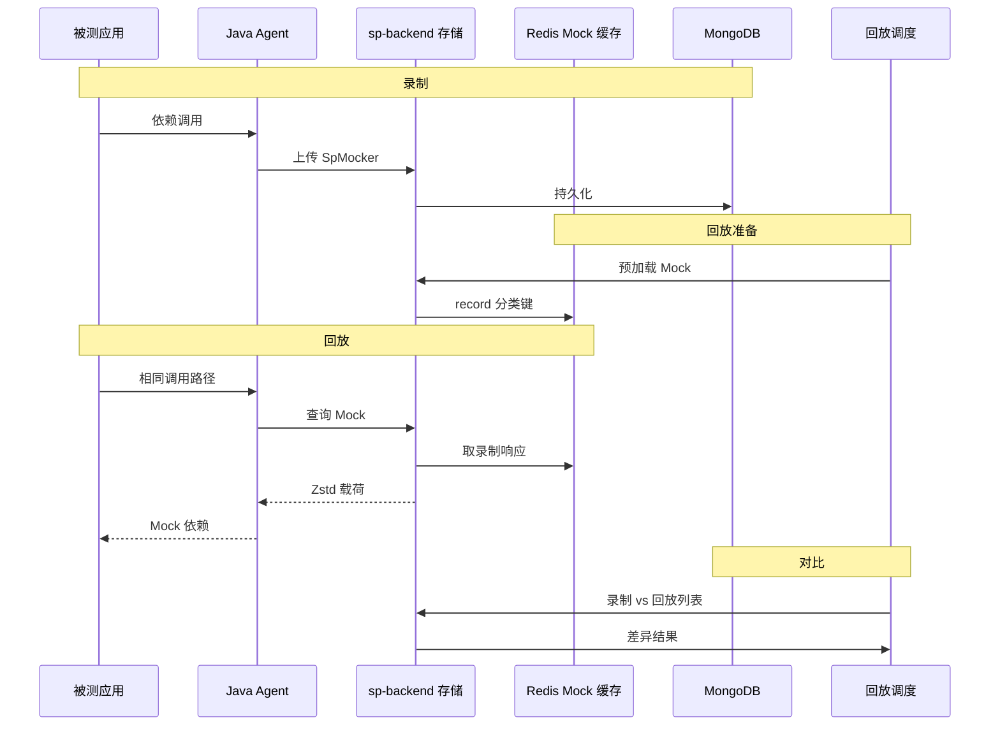

# 录制回放如何工作

Softprobe 测试采集的是一次**事务**：一条入口请求，以及该调用链上代码触达的每个依赖。回放时同一代码路径再次执行；外部调用由存储数据满足，而非访问真实系统。

## 端到端时序



## 录制阶段 {#recording-phase}

开启录制后，Agent 拦截：

| 类型 | 示例 | 存储内容 |
|------|------|----------|
| **入口** | `Servlet`、`DubboProvider`、`NettyProvider` | 入站 API 请求与响应 |
| **依赖** | `HttpClient`、`Database`、`Redis`、`DubboConsumer`、`DynamicClass` 等 | 每次对外调用的请求与响应 |

每次交互是一条 **mocker** 记录，按 `appId`、trace/用例标识、分类与操作名索引。

**如何产生用例：** [录制流量](/zh/testing/recording) · **录制范围配置：** [录制策略](/zh/testing/policies#recording-policy)

::: tip
用例**仅由**已织入 Agent 的流量产生。CLI 不支持手写用例；请在 Agent 录制期间向应用发送真实或合成流量。
:::

## 回放阶段

**回放计划**选择已录制用例，并将入口 HTTP 流量驱动到 **`targetEnv`** — 被测服务的基础 URL（例如 `http://order-service.test:8080`）。这与指向 sp-backend 的 `SP_API_URL` **不是**同一个地址。

回放过程中：

1. 调度服务将录制的入口请求发往 `targetEnv`。
2. 被测应用必须挂载 Agent（回放机器上可将录制频率设为 0）。
3. 每次依赖调用时，Agent 向存储查询**匹配的录制响应**。
4. 已预加载时从 Redis 读取；否则从 MongoDB 加载。

**入口与依赖的行为差异：**

- **入口**（`entryPoint` 分类）：存储会记录回放侧请求；业务代码中的 Controller/Handler 仍会真实执行。
- **依赖**：存储返回录制的 Mock 体，应用不会访问真实数据库或外部 API。

## 对比阶段

回放结束后，对比引擎配对录制与回放的 mocker。失败表示主响应或某依赖不一致（缺调用、值不同、多调用等）。

常见差异类型：

- **值差异** — 依赖被调用了，但响应体不同
- **缺调用** — 回放未调用录制时存在的依赖
- **多调用** — 回放调用了录制中不存在的依赖

通过[对比策略](/zh/testing/policies)与[回放与对比](/zh/testing/replay-and-diff)忽略噪声字段（时间戳、令牌、IP 等）。

## 示例说明

下面方法解析 IP 并调用校验逻辑：

```java
public Integer parseIp(String ip) {
    int result = 0;
    if (checkFormat(ip)) {
        String[] ipArray = ip.split("\\.");
        for (int i = 0; i < ipArray.length; i++) {
            result = result << 8;
            result += Integer.parseInt(ipArray[i]);
        }
    }
    return result;
}
```

**录制** — 当 `needRecord()` 为真时，Agent 保存入参与返回值。

**回放** — Agent 用存储结果短路执行，使 `checkFormat` 与解析行为与采集时一致，即使测试环境不同。

本地缓存、加解密、系统时间等**动态类**同样适用；通过录制策略与 Mock 策略配置，无需改业务代码。

## 存储结构（概念）

| 存储 | 作用 |
|------|------|
| **MongoDB** | 持久化录制、回放计划、对比结果 |
| **Redis** | 回放热路径 Mock 缓存（`record:{category}:{recordId}:…`） |

自托管时，`sp-backend` 通常是单一进程，在 **8090** 端口同时提供 API、存储与调度。

## 相关文档

- [Java Agent](/zh/testing/java-agent)
- [策略](/zh/testing/policies)
- [回放与对比](/zh/testing/replay-and-diff)
- [CLI 概念](/zh/testing/agents/concepts)
