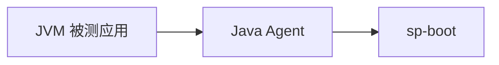

# Softprobe 测试

**录制真实流量。回放时自动 Mock。无需手写用例即可对比。**

::: tip 准备开始？
🚀 如果您是首次接触 Softprobe，建议直接前往 **[演示快速入门 (5分钟)](/zh/testing/demo-quickstart)**！通过预构建的 JAR 快速上手体验，无需任何繁琐配置。
:::

Softprobe 测试面向 **Java** 服务的**录制回放**回归。以 `-javaagent` 挂载 Softprobe Java Agent，在后台采集入口 API 流量与对外依赖调用，随后在测试环境回放已录制用例：依赖由存储数据 Mock，结果自动对比。

::: info 本站三个产品
| 产品 | 适用场景 |
|------|----------|
| **[平台](/zh/platform/)** | 需要 Istio/Envoy 网格采集、SESSIFY 会话上下文或可观测性仪表盘 |
| **测试**（本节） | 需要 Java 录制回放、JVM Agent、策略与回放语义 |
| **[CLI](/zh/cli/)** | 用 `sp` 命令自动化安装、回放与诊断 |
:::

## 为什么选择录制回放

传统集成测试需要维护环境、造数与手写用例。Softprobe 测试则：

- **零业务代码改动** — 通过 `sp-agent.jar` 做字节码织入
- **真实流量带来高覆盖** — 生产或预发请求直接成为回放用例
- **回放环境隔离** — 数据库、HTTP 客户端、Redis、RPC、缓存等由录制数据 Mock，测试环境无需真实下游
- **WRITE 路径更安全** — 回放依赖行为不会污染共享库表
- **降低对比噪声** — 对比规则、时间 Mock、忽略节点处理时间戳、随机 ID 与环境差异字段

## 组件分工

| 组件 | 作用 |
|------|------|
| **你的 Java 服务** | 被测应用，以 `-javaagent:…/sp-agent.jar` 启动 |
| **Softprobe Java Agent** | 运行时录制与回放；回放阶段 Mock 依赖 |
| **Softprobe 后端**（`:8090`） | 通过 Helm 部署。存储用例（MongoDB）、下发策略、执行回放计划、计算差异 |
| **`sp` CLI**（可选） | 注册应用、应用策略、发起回放、排查失败 — 见 [CLI 快速入门](/zh/cli/guide/quickstart) |
| **仪表盘 / 工作台**（可选） | 可视化差异与链路查看 |

## 录制 → 回放 → 对比（简述）

1. **录制** — Agent 在应用处理真实请求时采集入口流量（如 HTTP `Servlet`）与依赖调用（`HttpClient`、`Database`、`Redis` 等）。
2. **存储** — 后端持久化每次交互；回放热路径使用 Redis Mock 缓存。
3. **回放** — 调度服务将录制的入口请求发到**测试实例**（`targetEnv` URL）；Agent 返回录制的依赖响应，不访问真实下游。
4. **对比** — 引擎对比录制与回放流量；策略定义忽略项与匹配严格度。

详情：[如何录制](/zh/testing/recording) · [工作原理](/zh/testing/how-it-works) · [回放与对比](/zh/testing/replay-and-diff)

## 平台 Agent ≠ Java Agent

[平台](/zh/platform/advanced-guides/agent-architecture) 的 **SP-Istio Agent** 运行在 Envoy 侧车，采集网格 HTTP 流量。**Softprobe 测试**使用以 `-javaagent` 挂载的 **JVM Agent**。二者解决的问题不同；在 SaaS 部署中可同时接入同一后端做关联分析。

## 适合阅读本节的人

- 首次接触录制回放的 **Java 开发者**
- 无需完整下游栈即可做回归的 **QA / 发布工程师**
- 在 K8s 或镜像中配置 `sp-boot` 与 Agent 启动的 **平台工程师**
- **自动化作者** — 先理解概念，再看 [CLI 概览](/zh/cli/guide/overview) 中的 `--json` 约定

## 快速链接

- [演示快速入门 (5分钟)](/zh/testing/demo-quickstart) — Travel OTA 演示项目动手实践。
- [接入您的应用](/zh/testing/getting-started) — 将演示迁移至企业自己的 Java 服务。
- [如何录制](/zh/testing/recording) — 阶段 1：产生用例。
- [Java Agent](/zh/testing/java-agent) — 挂载、JVM 参数与生产安全。
- [策略概览](/zh/testing/policies) — 按阶段配置 YAML。
- [回放与对比](/zh/testing/replay-and-diff) — 阶段 2：回归运行。
- [Webhook 与 CI/CD](/zh/testing/webhook-and-ci) — 部署后触发回放与流水线门禁。
- [支持的框架](/zh/testing/supported-frameworks)
