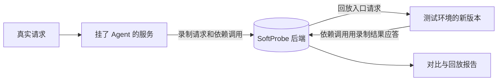

# 流量回放测试

把线上或测试环境的真实请求录下来，改完代码后在测试环境回放一遍，自动对比前后结果，找出改动带来的行为变化。不用手写用例，也不用改业务代码。

适用于 **Java** 服务：在服务的启动参数里加上 SoftProbe Java Agent 即可开始录制。

## 解决什么问题 {#why}

- **手写用例覆盖不到真实场景。** 线上请求的参数组合、边界情况，靠手工很难构造齐全。录下来的请求本身就是用例。
- **回归靠人工比对。** 改完代码后，哪些接口的返回变了，不用再一个个去对：回放完自动对比，差异定位到接口和字段。
- **测试环境凑不齐依赖。** 回放时，数据库、缓存、下游服务的调用可以直接用录制时的结果应答，测试环境不必准备一整套依赖。

## 怎么工作 {#how-it-works}

1. **录制**：服务处理真实请求时，Agent 记下入口请求、响应，以及处理过程中对数据库、缓存、下游接口的调用和结果。默认按采样录制，不是全量。
2. **回放**：把录下的入口请求重新发给测试环境里的新版本。新版本真实执行业务代码；它调用依赖时，Agent 用录制时的结果应答。
3. **对比**：对比录制时和回放时的响应和依赖调用，生成[回放报告](/zh/testing/replay-report)，说明哪些差异是代码改动引起的。

::: warning 回放不一定完全不碰真实依赖
只有 Agent 支持、并且在「回放配置」里设为 Mock 的调用，才会用录制结果应答。「回放配置」可以让某些依赖走真实调用，新建回放计划时也可以选择「本次回放强制所有依赖走真实调用」。所以回放目标请用测试环境，不要指向生产。
:::

详细过程见 [工作原理](/zh/testing/how-it-works)。

## 由哪些部分组成 {#components}

| 部分 | 作用 |
|------|------|
| **SoftProbe Java Agent** | 随被测服务一起启动的 jar，负责录制和回放时应答依赖调用 |
| **SoftProbe 后端** | 保存录制数据，执行回放和对比，生成报告 |
| **控制台** | 在浏览器里查看录制、发起回放、看报告、配置规则，也可以让 AI 分析失败原因 |
| **`sp` 命令行**（可选） | 写脚本、接 CI、让 AI 代理操作 SoftProbe 时使用 |

## 从哪里开始 {#where-to-start}

| 你是 | 从这里开始 |
|------|-----------|
| 测试、开发，要用 SoftProbe 做回归 | [第一次录制回放](/zh/testing/getting-started)，然后看「日常使用」这一组 |
| 运维或平台管理员，要部署平台 | [部署后端](/zh/testing/installation/server)、[接入 Java Agent](/zh/testing/java-agent) |
| 维护流水线，要在发版后自动回放 | [发版后自动回放](/zh/testing/webhook-and-ci) |
| 写脚本、插件，或让 AI 代理对接 | [选择接入方式](/zh/testing/agents/overview) |

支持哪些 Java 版本和框架，见 [支持的 Java 版本与框架](/zh/testing/supported-frameworks)。

::: info 业务观测
站内「业务观测」部分讲的是基于 Istio/Envoy 的网格流量采集，仅适用于 SoftProbe Cloud，与这里的 Java Agent 录制回放是两套东西。
:::
