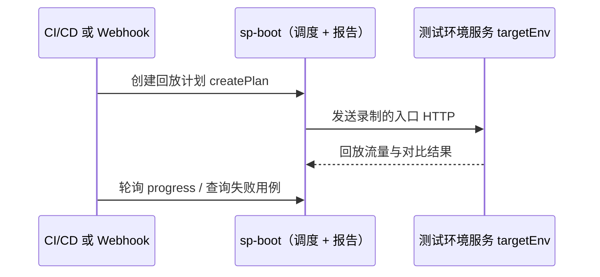

# Webhook 触发回放与 CI/CD 集成

在部署或合并后自动对**测试环境**中的服务发起录制回放，并根据对比结果决定流水线是否通过。本节说明两种触发方式、如何拿到结果，以及 GitHub Actions 与 Jenkins 的集成模式。

::: tip 先录制，再自动化回放
Webhook 与 CI 都不会替你产生用例。请先走通核心流程 [① 录制](/zh/testing/recording) 与 [② 回放](/zh/testing/replay-and-diff)（`appId`、策略、`targetEnv` 可达），再把它交给自动化。
:::

## 该用 `sp` CLI 还是 REST API？

| 场景 | 推荐 |
|------|------|
| **GitHub Actions、Jenkins、GitLab CI** 等完整流水线 | **`sp` CLI**（`--json`、稳定退出码、内置轮询） |
| **部署钩子**（Argo CD、K8s Job、脚本）只需「部署成功 → 立刻开跑」 | **GET Webhook**（`curl` 一行触发） |
| **自研编排**、已有 HTTP 客户端、需精细控制请求体 | **REST**（`POST /api/createPlan` + 报告类 API） |

**原则：** 流水线里负责「创建计划 → 等待结束 → 拉失败用例 → 判定通过/失败」时，优先用 **`sp replay run --watch`** 与 **`sp replay case list --failed`**，与 [CLI 输出约定](/zh/testing/agents/output-contract) 一致。Webhook GET 适合**只负责触发**；结果查询仍建议在同一流水线后续步骤用 `sp` 或带 `access-token` 的报告 API。

CLI 细节见 [replay 命令](/zh/testing/commands/replay)、[认证](/zh/testing/agents/authentication)。

## 架构（简述）



- **`SP_API_URL`**：sp-boot 地址（存储、调度、报告），**不是**被测服务 URL。
- **`targetEnv`**：被测服务基础 URL（如 `http://order-service.test.svc:8080`），与 `SP_API_URL` 不可混淆 — 见 [CLI 概念：targetEnv](/zh/testing/agents/concepts#replay-target-url-targetenv)。

## 方式一：Webhook（GET）触发回放

调度服务提供 **GET** `/api/createPlan`，供部署 Webhook、监控告警或简单 `curl` 调用。服务端将 `operator` 记为 `Webhook`，默认按 **应用维度** 选取最近 **24 小时**内录制的用例（可通过时间参数缩小范围）。

### 请求示例

```bash
curl -sS -G "${SP_API_URL}/api/createPlan" \
  -H "access-token: ${SP_TOKEN}" \
  --data-urlencode "appId=YOUR_APP_ID" \
  --data-urlencode "targetEnv=http://your-service.test:8080" \
  --data-urlencode "planName=post-deploy-smoke" \
  --data-urlencode "caseCountLimit=50" \
  --data-urlencode "enableMock=true"
```

### 常用查询参数

| 参数 | 必填 | 说明 |
|------|------|------|
| `appId` | 是 | 已注册应用 id |
| `targetEnv` | 是 | 测试实例基础 URL（含 `http://` 或 `https://`） |
| `caseSourceFrom` | 否 | 用例时间窗起点（Unix **毫秒**）；默认约 24 小时前 |
| `caseSourceTo` | 否 | 用例时间窗终点（毫秒）；默认当前时间 |
| `caseCountLimit` | 否 | 最多回放条数 |
| `planName` | 否 | 计划显示名 |
| `operationIds` | 否 | 可重复，仅回放指定操作 id |
| `enableMock` | 否 | `true` / `false`，默认按服务端策略 |
| `caseTags` | 否 | JSON 字符串，按标签过滤用例 |

### 响应

成功时 `result` 为 `1`，`data` 中含 **`replayPlanId`**（即后续轮询用的 `planId`）：

```json
{
  "result": 1,
  "desc": "success",
  "data": {
    "replayPlanId": "plan-abc123"
  }
}
```

::: warning
GET Webhook **只创建计划**，不会等待回放结束。请在 CI 后续步骤轮询进度或查询报告，见下文「获取结果」。
:::

::: info POST 与 GET
`POST /api/createPlan`（`sp replay run` 使用）支持完整 `BuildReplayPlanRequest`（时间窗、`operationCaseInfoList`、压测参数等）。复杂选例请用 POST 或 CLI，不要用 GET 勉强拼参数。
:::

## 方式二：CLI / REST 创建计划（推荐用于 CI）

与 [② 回放与对比](/zh/testing/replay-and-diff) 相同，CI 中常用：

```bash
export SP_API_URL=https://your-tenant.softprobe.ai   # 或内网 sp-boot :8090
export SP_TOKEN="${SP_TOKEN}"                         # 来自密钥库，勿写入仓库

sp replay run \
  --app YOUR_APP_ID \
  --env http://your-service.test:8080 \
  --from -24h \
  --name "ci-${GITHUB_SHA:-build}" \
  --watch \
  --json
```

`--watch` 会在创建计划后轮询 `GET /api/progress?planId=…`，直到进度结束。回放**对比失败**时 CLI 仍可能以 **0** 退出 — 流水线必须再检查失败用例（见下节）。

等价的 REST 创建（需 `access-token` 头）：

```http
POST /api/createPlan
Content-Type: application/json
access-token: <JWT>

{
  "appId": "YOUR_APP_ID",
  "targetEnv": "http://your-service.test:8080",
  "caseSourceFrom": 1717000000000,
  "caseSourceTo": 1717086400000,
  "enableMock": true,
  "planName": "ci-build-42"
}
```

## 获取回放结果

### 1. 轮询进度

```bash
sp replay status plan-abc123 --watch --json
```

REST：`GET /api/progress?planId=plan-abc123`（同一 `SP_API_URL`）。返回体含 `percent` 等字段；`percent` 达到 100 表示调度侧执行完毕。

### 2. 判定通过 / 失败（CI 门禁）

进度结束后，查询是否存在失败用例：

```bash
sp replay case list --plan plan-abc123 --failed --limit 1 --json
```

若 `data.items` 非空，或配合 `jq` 统计条数大于 0，则令流水线 **失败**。需要差异详情时：

```bash
sp replay diff get <diffId> --out-dir .sp-work --json
sp diagnose replay plan-abc123 --failed-only --out-dir .sp-work --json
```

参见 [示例：诊断回放失败](/zh/testing/examples/agent-diagnose-replay)。

### 3. 仪表盘（人工）

可在 Softprobe 工作台或仪表盘中打开同一 `planId` 查看差异树；自动化应以 CLI/`--json` 为准。

## GitHub Actions 示例

在**测试环境已部署且 Agent 已挂载**的 job 中运行（Secrets：`SP_API_URL`、`SP_TOKEN`）。

```yaml
name: Softprobe replay gate

on:
  workflow_dispatch:
  push:
    branches: [main]

jobs:
  replay-regression:
    runs-on: ubuntu-latest
    env:
      SP_API_URL: ${{ secrets.SP_API_URL }}
      SP_TOKEN: ${{ secrets.SP_TOKEN }}
      SP_APP_ID: ${{ vars.SP_APP_ID }}
      SP_TARGET_ENV: http://my-service.test:8080
    steps:
      - name: Install sp
        run: |
          curl -fsSL -o sp "${SP_DOWNLOAD_URL:-https://install.softprobe.ai/artifacts/sp/latest}/sp-linux-amd64"
          chmod +x sp && sudo mv sp /usr/local/bin/

      - name: Preflight
        run: |
          sp health --json
          sp record case list --app "$SP_APP_ID" --since -24h --json

      - name: Run replay and wait
        id: replay
        run: |
          sp replay run \
            --app "$SP_APP_ID" \
            --env "$SP_TARGET_ENV" \
            --from -24h \
            --name "gha-${GITHUB_SHA}" \
            --watch \
            --json | tee replay.ndjson
          PLAN_ID=$(grep '"command":"replay run"' replay.ndjson | tail -1 | jq -r '.data.planId // .data.replayPlanId')
          echo "plan_id=$PLAN_ID" >> "$GITHUB_OUTPUT"

      - name: Fail if any case failed
        run: |
          COUNT=$(sp replay case list --plan "${{ steps.replay.outputs.plan_id }}" --failed --json \
            | jq '[.data.items[]?] | length')
          if [ "$COUNT" -gt 0 ]; then
            echo "Replay had $COUNT failed case(s)"
            exit 1
          fi
```

可选：在 **deploy** workflow 末尾用 Webhook 仅触发（不等待），在独立 job 中做 `status --watch` 与门禁。

```yaml
      - name: Trigger replay webhook (fire-and-forget)
        run: |
          curl -fsS -G "$SP_API_URL/api/createPlan" \
            -H "access-token: $SP_TOKEN" \
            --data-urlencode "appId=$SP_APP_ID" \
            --data-urlencode "targetEnv=$SP_TARGET_ENV" \
            --data-urlencode "planName=deploy-${{ github.run_id }}"
```

策略校验可合并到 PR，见 [示例：CI 策略门禁](/zh/testing/examples/ci-policy-gate)。

## Jenkins 示例

使用 **Credentials** 绑定 `SP_TOKEN`，在 Declarative Pipeline 中：

```groovy
pipeline {
  agent any
  environment {
    SP_API_URL = credentials('sp-api-url')
    SP_TOKEN   = credentials('sp-token')
    SP_APP_ID  = 'YOUR_APP_ID'
    SP_TARGET_ENV = 'http://my-service.test:8080'
  }
  stages {
    stage('Replay') {
      steps {
        sh '''
          sp replay run \
            --app "$SP_APP_ID" \
            --env "$SP_TARGET_ENV" \
            --from -24h \
            --name "jenkins-${BUILD_NUMBER}" \
            --watch \
            --json > replay.ndjson
          PLAN_ID=$(grep '"command":"replay run"' replay.ndjson | tail -1 | jq -r '.data.planId // .data.replayPlanId')
          FAILED=$(sp replay case list --plan "$PLAN_ID" --failed --json | jq '[.data.items[]?] | length')
          test "$FAILED" -eq 0
        '''
      }
    }
  }
}
```

Webhook 触发可放在 **Post-deployment** 步骤：`curl -G …/api/createPlan`；在后续 stage 用 `sp replay status <planId> --watch` 等待并门禁。

安装 `sp`：在 agent 镜像中预装，或 `curl` 安装脚本与 GitHub Actions 相同。

## 安全与运维建议

- **`SP_TOKEN` 仅放在 CI 密钥库**，不要提交到 Git；轮换泄露的令牌 — [认证](/zh/testing/agents/authentication)。
- Webhook URL 若暴露在公网，应配合网络策略、IP 允许列表，并始终携带 **`access-token`**（与 CLI 相同）。
- 回放会向 **`targetEnv` 发送真实 HTTP**；仅在测试/预发实例上配置 Webhook，勿指向生产入口 — [② 回放与对比](/zh/testing/replay-and-diff)。
- 回放机上**降低或关闭录制**，避免回放过程中再录一套数据。

## 相关文档

- [回放与对比](/zh/testing/replay-and-diff)
- [快速开始](/zh/testing/getting-started)
- [CLI：replay](/zh/testing/commands/replay)
- [REST API 映射](/zh/testing/reference/api-mapping)
- [CLI 快速入门](/zh/testing/getting-started)
